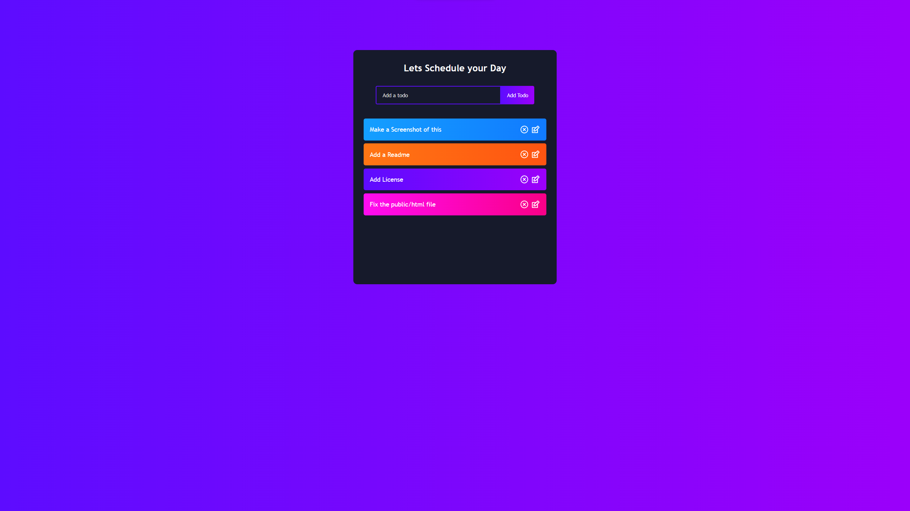
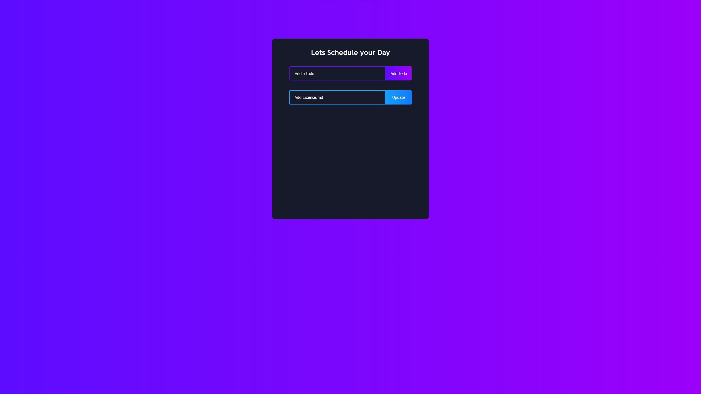

# Todo App JS

## Table of Contents

- [Todo App JS](#todo-app-js)
  - [Table of Contents](#table-of-contents)
  - [Description](#description)
  - [Getting Started](#getting-started)
    - [To install](#to-install)
    - [To run](#to-run)
      - [Screens](#screens)
      - [Home page](#home-page)
      - [Edit page](#edit-page)
  - [License](#license)

## Description
This is a simple todo app made with ReactJS and React Router Dom.

## Getting Started

### To install

```bash
pnpm install
```

*also you can use

### To run

```bash
pnpm start
```

#### Screens

#### Home page



#### Edit page



## License

This project is licensed under the Pylar License - see the [LICENSE.md](LICENSE.md) file for details